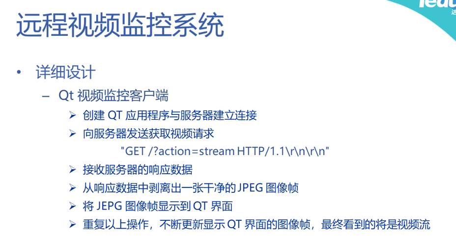
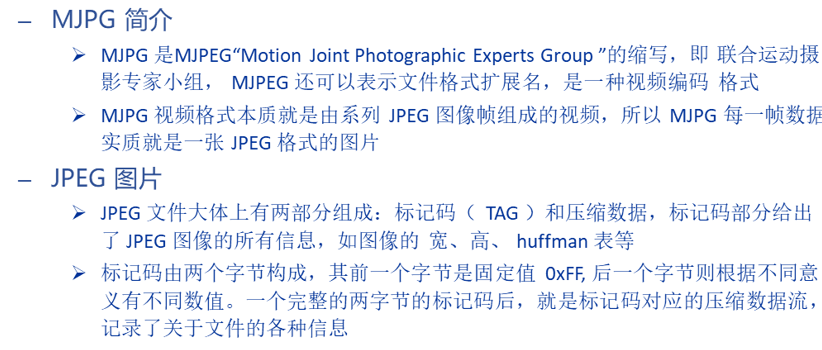
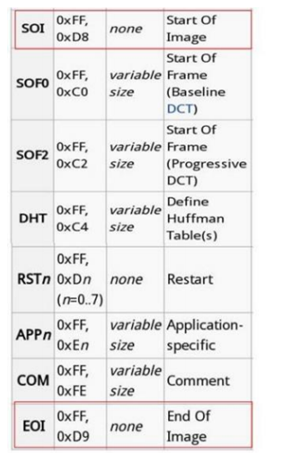

### JPEG 格式

| 标记码     |                                   | 数据字节流 |
| ---------- | --------------------------------- | ---------- |
| 0xFF(固定) | 不同值代表不同含义 （大小一字节） | ……         |

一个图片应该被表示为    SOI(2B)……EOI(2B)

**这两个后面跟上的字节大小为0**  

https://doc.qt.io/qt-6/qtnetwork-http-example.html

HTTP中用到的QT类

